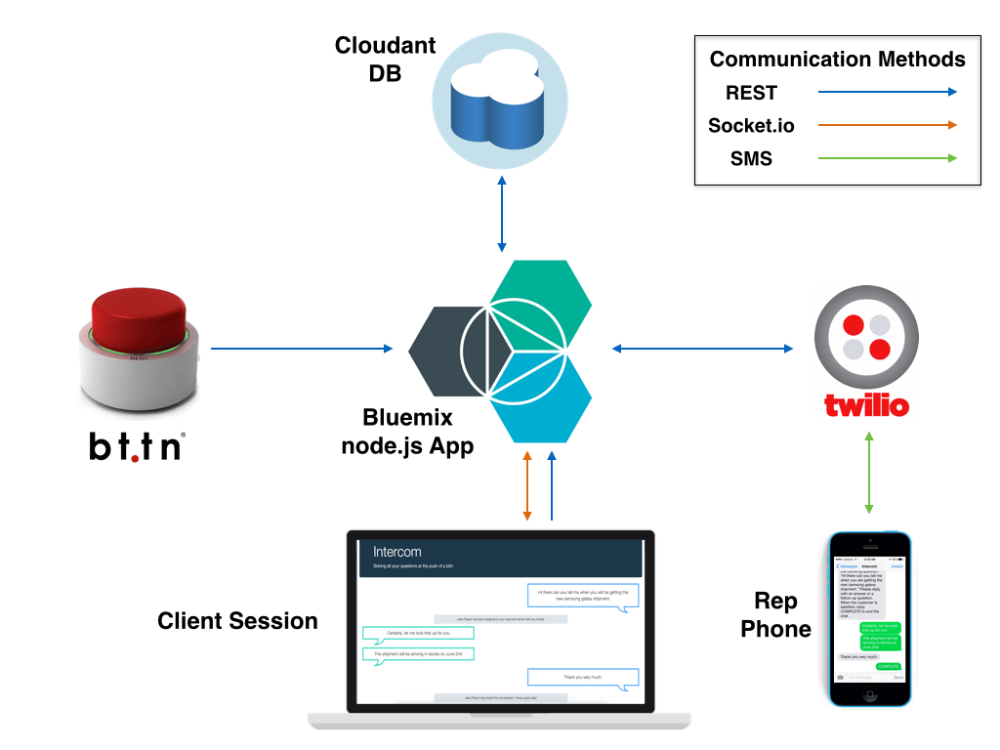

# Overview

Intercom allows users to remotely chat with representatives using Watson [Speech to Text][speech_text_url] technology. The representatives are notified via text and can reply directly to the user by SMS using the [Twilio APIs][twilio_url]. All of this is kicked off at the push of a [bttn][bttn_url], enabling users to comminute with ultimate ease by completely avoid manual input into the app.

**ATTENTION**: Instructions for integrating and setting up the bttn have not yet been added. The app works by clicking the microphone button with your mouse as well, so please use this method of initiating speech recognition for the time being. Thank you!

[](https://bluemix.net/deploy)

*Note: If deploying by this method, the app will fail on first deploy. After this initial failure, you must complete steps 6-9 and 14-16 as described in the section 'Running the app on Bluemix' below for your app to start successfully.

## How it Works

1. Push the bttn to start a conversation.

2. Once the mic is flashing red, start recording your message. The app will automatically detect when you are done speaking and send the message. Your chat will be automatically assigned to an available representative.

3. Using Twilio, the rep will respond to your inquiry.

4. This manner of communication can continue as long as either party would like. Once the rep has decided that they have addressed the user's concerns, they will end the chat.

5. Rinse and repeat to your heart's content!

### Architecture Diagram

<br>This an architectural overview of the components that make this app run.<br>

## Running the app on Bluemix

1. Create a Bluemix Account

    [Sign up][bluemix_signup_url] in Bluemix, or use an existing account.

2. Download and install the [Cloud-foundry CLI][cloud_foundry_url] tool

3. Clone the app to your local environment from your terminal using the following command

  ```
  git clone https://github.com/IBM-Bluemix/intercom-nodejs.git
  ```

4. cd into this newly created directory

5. Edit the `manifest.yml` file and change the `<application-name>` and `<application-host>` to something unique.

  ```
  applications:
  - name: intercom-sample-app-test
    framework: node
    runtime: node10
    memory: 512M
    instances: 1
    host: intercom-sample-app-test
  ```
  The host you use will determinate your application url initially, e.g. `<application-host>.mybluemix.net`.

6. Next, you need to sign up for a Twilio developer account if you do not have one already. You can do this [here] [twilio_signup_url].

7. Once you have created an account, navigate to your account page. Take note of your Account SID and AuthToken on this page, as you will need these later.

8. Navigate to the [Manage Numbers][twilio_numbers_url] section on the Twilio website. Provision a Twilio number for your developer account so that your app is able to send text messages.

	**Note**: Although it is relatively cheap, remember that Twilio is not a free service! Check out the [Twilio SMS Pricing][twilio_sms_pricing_url] page for details.

9. Open up `app.js` and go to the Twilio setup section. Set the `twilioNumber` variable equal to the number which you just provisioned in step 8.

	Next, navigate to the `seedDB` function definition. Edit the `initialRep` variable to reflect your name and mobile phone number.

	```
	var initialRep = {
    	"type" : "rep",
    	"repName" : "<your-name>",
    	"repPhoneNum" : "<your-phone-number>",
    	"state" : "Available"
    }
	```

10. Connect to Bluemix in the command line tool and follow the prompts to log in.
  
  ```
  $ cf api https://api.ng.bluemix.net
  $ cf login
  ```

11. Create the Cloudant service in Bluemix.
  
  ```
  $ cf create-service cloudantNoSQLDB Shared intercom-cloudant
  ```

12. Create the Speech to Text service in Bluemix.
  
  ```
  $ cf create-service speech_to_text free intercom-speech-to-text
  ```

13. Push it to Bluemix. We need to perform additional steps once it is deployed, so we will add the optional `--no-start` argument

  ```
  $ cf push --no-start
  ```

14. Go to the Bluemix catalog, create a Twilio service using the credentials from step 7, name it "Twilio", and choose to bind it to your new application.

15. Create a user provided service to store your DB reset credentials

  ```
  $ cf cups CloudantCleanser -p '{"host":"https://<app-host>.mybluemix.net/db/reset","username":"<username>","password":"<password>"}'
  ```
Be sure to replace `<app-host>` with your app's hostname and `<username>` and `<password>` with values of your choosing. For an explanation of why this is needed, see the below section titled 'Resetting the DB'.

16. Finally, we need to restage our app to ensure these env variables changes took effect.

  ```
  $ cf restage <app-name>
  ```

And voila! You now have your very own instance of Intercom running on Bluemix.

When your application starts up, it will create a new DB and initialize it to the default state. You will initially only have a single representative with the name and phone number you gave them in step 9. Feel free to add additional reps to the DB using the Cloudant dashboard or curl commands. The more reps you have, the more concurrent sessions your system can accommodate.

### Resetting the DB

Sometimes the DB can become cluttered with stale documents, especially when testing your app. I've included a request handler that allows you to securely reset your DB. This call will erase all chat and message documents while making all your reps available once again. To reset your DB, make an HTTP GET request to the following url with your CloudantCleanser credentials:

  ```
  https://<hostname>.mybluemix.net/db/reset?username=<username>&password=<password>
  ```

### Troubleshooting

To troubleshoot your Bluemix app the main useful source of information is the logs. To see them, run:

  ```
  $ cf logs <application-name> --recent
  ```

### Privacy Notice

The Intercom sample web application includes code to track deployments to Bluemix and other Cloud Foundry platforms. The following information is sent to a [Deployment Tracker][deploy_track_url] service on each deployment:

* Application Name (`application_name`)
* Space ID (`space_id`)
* Application Version (`application_version`)
* Application URIs (`application_uris`)

This data is collected from the `VCAP_APPLICATION` environment variable in IBM Bluemix and other Cloud Foundry platforms. This data is used by IBM to track metrics around deployments of sample applications to IBM Bluemix. Only deployments of sample applications that include code to ping the Deployment Tracker service will be tracked.

### Disabling Deployment Tracking

Deployment tracking can be disabled by removing `require("cf-deployment-tracker-client").track();` from the beginning of the `app.js` main server file.

[speech_text_url]: https://www.ibm.com/smarterplanet/us/en/ibmwatson/developercloud/speech-to-text.html
[twilio_signup_url]: https://www.twilio.com/try-twilio
[twilio_numbers_url]: https://www.twilio.com/user/account/phone-numbers/incoming
[twilio_sms_pricing_url]: https://www.twilio.com/sms/pricing
[twilio_url]: https://www.twilio.com/docs/api
[bttn_url]: http://bt.tn/
[bluemix_signup_url]: https://console.ng.bluemix.net/?cm_mmc=Display-GitHubReadMe-_-BluemixSampleApp-Intercom-_-Node-WatsonSpeechToText-_-BM-DevAd
[cloud_foundry_url]: https://github.com/cloudfoundry/cli
[deploy_track_url]: https://github.com/cloudant-labs/deployment-tracker